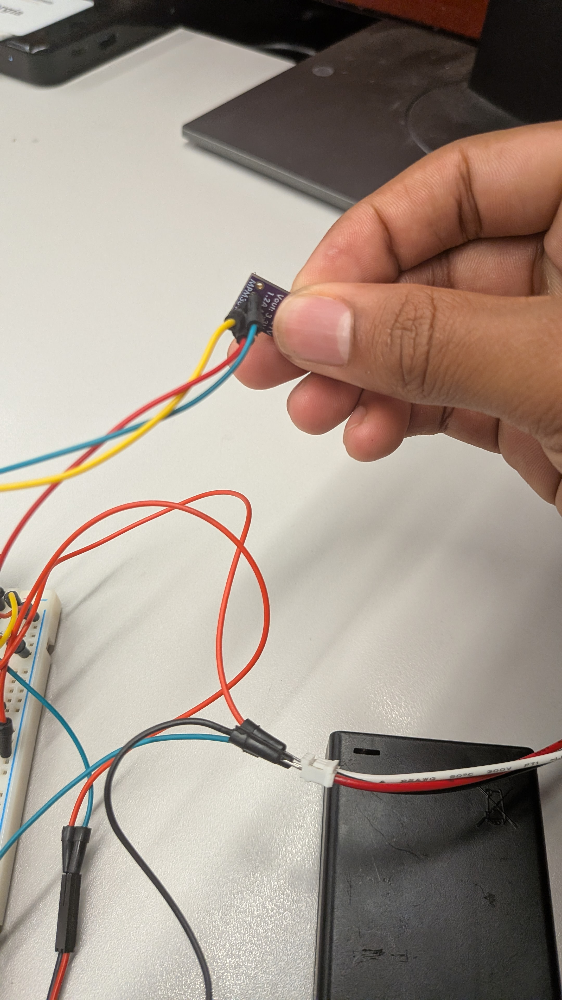
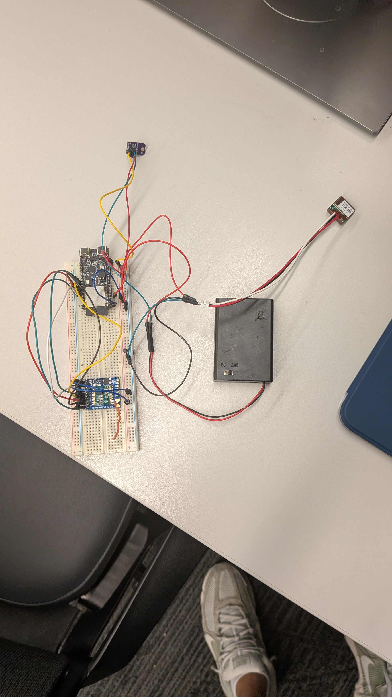

# Cow GPS Tracker -- Complete Build Guide

A practical, step-by-step guide to building a low-cost livestock GPS tracking system
using ESP32-C6 microcontrollers, LoRa/FSK radio, and a real-time web dashboard.

This guide covers both the **ideal build order** and documents the **actual issues we
encountered** so you can avoid them.

---

## Table of Contents

1. [Project Overview](#1-project-overview)
2. [System Architecture](#2-system-architecture)
3. [Bill of Materials](#3-bill-of-materials)
4. [Wiring Diagrams](#4-wiring-diagrams)
5. [Software Setup](#5-software-setup)
6. [Step-by-Step Build Order](#6-step-by-step-build-order)
7. [Dashboard Usage](#7-dashboard-usage)
8. [Troubleshooting Guide](#8-troubleshooting-guide)
9. [Future Improvements](#9-future-improvements)

---

## 1. Project Overview

This project tracks the location and behavior of cattle using GPS and an accelerometer,
transmits the data wirelessly over sub-GHz FSK radio, and displays everything on a
real-time web dashboard with a map, geofencing, and alerts.

**What it does:**

- The **collar** (worn by the cow) reads GPS coordinates and accelerometer data,
  classifies the cow's behavior (resting, grazing, walking, running), and transmits
  JSON packets over 915 MHz FSK radio.
- The **gateway** (placed at a barn or farmhouse) receives the radio packets, connects
  to Wi-Fi, and forwards the data via HTTP POST to a dashboard server.
- The **dashboard** (runs on a laptop/PC) displays a live map with cow positions,
  movement trails, behavior badges, geofence alerts, and herd statistics.

**Key design decisions:**

- The collar uses an **SX1276 (RFM9x) in FSK mode** -- not LoRa mode -- so it can
  communicate directly with the cheaper **RFM69HCW** on the gateway side. Both chips
  speak the same FSK packet format at 915 MHz / 4800 bps.
- JSON keys are shortened on the collar (`la`, `lo`, `bh`, etc.) to fit in small
  radio packets (61-byte payload limit), then expanded to full names (`lat`, `lon`,
  `behavior`) by the gateway before forwarding.
- The accelerometer uses a simple variance-based classifier with four states. The GPS
  reporting interval adapts to the behavior: 60s when resting, 5s when walking, 1s
  when running -- saving battery.

---

## Project Photos

### Full System Overview

*Complete system: collar (left) with battery pack and GPS, gateway (right) connected to laptop*

### Collar Unit

*Collar unit: ESP32-C6 + RFM69HCW radio + GP-20U7 GPS module, powered by AA battery pack through MPM3610 regulator*

### Collar Close-up

*Close-up of the collar breadboard showing ESP32-C6 and RFM69HCW radio module with wire antenna*

### Gateway Unit

*Gateway: ESP32-C6 + RFM69HCW radio, connected to laptop via USB. Receives radio packets and forwards to dashboard*

### Gateway Close-up

*Close-up of gateway showing RFM69HCW radio module with SPI wiring and wire antenna*

### MPM3610 Voltage Regulator

*MPM3610 buck converter: steps down battery voltage to 3.3V for the collar electronics*

### Battery Pack

*AA battery pack with ON/OFF switch, connected to MPM3610 regulator via jumper wires*

---

## 2. System Architecture

```
                          915 MHz FSK Radio
  +------------------+     (up to ~1 km)      +------------------+
  |   COW COLLAR     | ~~~~~~~~~~~~~~~~~~~~~~> |    GATEWAY       |
  |                  |                         |                  |
  |  ESP32-C6        |                         |  ESP32-C6        |
  |  GP-20U7 (GPS)   |                         |  RFM69HCW        |
  |  SX1276 (FSK TX) |                         |  Wi-Fi STA       |
  |  MPU6050 (accel) |                         |                  |
  |  LiPo + MPM3610  |                         |  USB powered     |
  +------------------+                         +------------------+
                                                       |
                                                       | HTTP POST
                                                       | (Wi-Fi LAN)
                                                       v
                                               +------------------+
                                               |   DASHBOARD      |
                                               |   (PC/Laptop)    |
                                               |                  |
                                               |  Flask + SocketIO|
                                               |  Leaflet.js map  |
                                               |  Geofence alerts |
                                               +------------------+
                                                       |
                                                       v
                                               +------------------+
                                               |   WEB BROWSER    |
                                               |  http://host:5000|
                                               +------------------+
```

**Data flow:**

1. GPS module sends NMEA sentences to ESP32-C6 over UART (9600 baud)
2. Collar firmware parses GPS, reads accelerometer, classifies behavior
3. Collar builds a compact JSON string and transmits via SX1276 FSK
4. Gateway's RFM69HCW receives the packet, reads RSSI
5. Gateway expands shortened JSON keys and appends RSSI value
6. Gateway HTTP POSTs the full JSON to the dashboard server
7. Dashboard processes the update, checks geofence, emits via Socket.IO
8. Browser updates map markers, trails, sidebar, and alerts in real time

---

## 3. Bill of Materials

| Component | Quantity | Approx. Cost | Notes |
|-----------|----------|-------------|-------|
| ESP32-C6 DevKitC-1 | 2 | $8 each | One for collar, one for gateway. RISC-V based, has Wi-Fi 6 + BLE 5. |
| GP-20U7 GPS Module | 1 | $15 | 1 Hz update, 3.3V, TX-only output. Small and low power. |
| RFM9x / SX1276 LoRa Module | 1 | $10 | For the collar. We use it in **FSK mode**, not LoRa mode. 915 MHz version. |
| RFM69HCW Breakout (Adafruit) | 1 | $10 | For the gateway. Adafruit breakout board. 915 MHz version. |
| MPU6050 Accelerometer Module | 1 | $3 | Optional. For behavior detection. GY-521 breakout works fine. |
| MPM3610 3.3V Buck Converter | 1 | $5 | Pololu breakout. Converts 3.7-4.2V LiPo to stable 3.3V. |
| 3.7V LiPo Battery | 1 | $8-12 | 400 mAh minimum, 1000-2000 mAh recommended for longer runtime. |
| TP4056 Charger Module | 1 | $1 | Optional. For charging the LiPo via micro-USB. |
| Breadboard (full-size) | 2 | $4 each | One per device. Half-size works for gateway. |
| Jumper Wires (M-M, M-F) | 1 pack | $5 | You will use a lot of these. |
| Wire antenna (quarter-wave) | 2 | $0 | Cut from solid-core wire: 8.2 cm for 915 MHz. Solder to ANT pad. |
| Soldering iron + solder | 1 | $20-40 | Required for radio module headers and antenna wire. |
| USB-C cables | 2 | $5 each | For programming and power. **Make sure they are data cables, not charge-only.** |

**Estimated total: ~$100-120**

**Where to buy:**

- ESP32-C6: Digikey, Mouser, or AliExpress (cheaper but slower shipping)
- GPS (GP-20U7): SparkFun or Amazon
- RFM9x: Adafruit (product 3072) or AliExpress
- RFM69HCW breakout: Adafruit (product 3070 for 915 MHz)
- MPU6050: Amazon or AliExpress (GY-521 breakout)
- MPM3610: Pololu (product 2842 for 3.3V output)

---

## 4. Wiring Diagrams

### 4.1 Collar Wiring (ESP32-C6 + GPS + SX1276 + MPU6050)

```
ESP32-C6 DevKitC-1              GP-20U7 GPS
======================          ===========
  3.3V  ──────────────────────> VCC
  GND   ──────────────────────> GND
  GPIO5 <────────────────────── TX    (GPS transmits NMEA to ESP32)
                                RX    (not connected -- we only read)


ESP32-C6 DevKitC-1              SX1276 / RFM9x Module
======================          ======================
  3.3V  ──────────────────────> VIN / 3.3V
  GND   ──────────────────────> GND
  GPIO18 (SCK)  ──────────────> SCK
  GPIO19 (MISO) <────────────── MISO
  GPIO20 (MOSI) ──────────────> MOSI
  GPIO21 (CS)   ──────────────> CS / NSS
  GPIO22 (RST)  ──────────────> RST / RESET
  GPIO23 (DIO0) <────────────── G0 / DIO0
                                ANT ── 8.2 cm wire antenna


ESP32-C6 DevKitC-1              MPU6050 (GY-521 breakout)
======================          =========================
  3.3V  ──────────────────────> VCC
  GND   ──────────────────────> GND
  GPIO6 (SDA) <───────────────> SDA
  GPIO7 (SCL) <───────────────> SCL
                                AD0 ── GND  (sets address to 0x68)
                                INT    (not connected)
```

### 4.2 Gateway Wiring (ESP32-C6 + RFM69HCW)

```
ESP32-C6 DevKitC-1              RFM69HCW (Adafruit Breakout)
======================          ============================
  3.3V  ──────────────────────> VIN
  GND   ──────────────────────> GND
  GPIO18 (SCK)  ──────────────> SCK     (RIGHT side of breakout)
  GPIO19 (MISO) <────────────── MISO    *** LEFT side of breakout! ***
  GPIO20 (MOSI) ──────────────> MOSI    (RIGHT side of breakout)
  GPIO21 (CS)   ──────────────> CS      *** LEFT side of breakout! ***
  GPIO22 (RST)  ──────────────> RST     (RIGHT side of breakout)
  GPIO23 (DIO0) <────────────── G0      (RIGHT side of breakout)
                                EN      (leave unconnected)
                                ANT ─── 8.2 cm wire antenna
```

**CRITICAL NOTE about the Adafruit RFM69HCW breakout:**

The Adafruit breakout has pins on BOTH sides of the board. Most pins (SCK, MOSI, RST,
G0, VIN, GND) are on the right side. But **MISO and CS are on the LEFT side** of the
board. You MUST solder header pins to the left side and connect those two wires, or
SPI communication will fail completely.

If you only solder the right-side headers (which is the intuitive thing to do), you
will read 0x00 from every register because MISO has no connection.

### 4.3 Power Wiring (Battery-Powered Collar)

```
                    MPM3610 Buck Converter
                    ======================
  LiPo+ ─────────> VIN                OUT ─────────> 3.3V rail
  LiPo- ─────────> GND                GND ─────────> GND rail

  3.3V rail ──> ESP32-C6 3.3V pin
  3.3V rail ──> GPS VCC
  3.3V rail ──> SX1276 VIN
  3.3V rail ──> MPU6050 VCC

  GND rail ───> all GND pins
```

**Power warnings:**

- NEVER connect USB and battery simultaneously to the ESP32-C6. The USB 5V and
  battery voltage can conflict and damage the board or battery.
- The MPM3610 accepts 3.6V-21V input and outputs a stable 3.3V. It is much more
  efficient than a linear regulator.
- A 1000 mAh LiPo should give roughly 8-12 hours of runtime depending on GPS fix
  rate and radio transmit frequency.
- If using the TP4056 charger: disconnect the battery from the collar circuit while
  charging, or use a proper charge-and-load circuit.

---

## 5. Software Setup

### 5.1 ESP-IDF Installation (v6.0)

The firmware uses Espressif's ESP-IDF framework, version 6.0.

1. Download and install ESP-IDF v6.0 from:
   https://docs.espressif.com/projects/esp-idf/en/v6.0/esp32c6/get-started/index.html

2. On Windows, use the **ESP-IDF Tools Installer** which sets up Python, CMake, Ninja,
   and the RISC-V toolchain automatically.

3. After installation, you should have an "ESP-IDF v6.0 PowerShell" shortcut in your
   Start menu.

**IMPORTANT: Use PowerShell, not Git Bash.**

Git Bash sets the `MSYSTEM` environment variable (to MINGW64 or similar), which
causes `idf.py` to fail with an error about MSys/Mingw shells not being supported.
Always use PowerShell or the ESP-IDF Command Prompt for building and flashing.

If you must use Git Bash for other tasks and see this error, you can work around it:

```powershell
# In PowerShell, remove the problematic variable before running idf.py:
$env:MSYSTEM = $null
```

### 5.2 Python + Flask for Dashboard

```bash
# Create a virtual environment (recommended)
python -m venv venv
# Activate it:
#   Windows PowerShell: .\venv\Scripts\Activate.ps1
#   Windows CMD:        venv\Scripts\activate.bat
#   Linux/Mac:          source venv/bin/activate

# Install dependencies
pip install flask flask-socketio pyserial
```

### 5.3 Building and Flashing Firmware

**Collar firmware** (from `c:\Users\dorsa\esp-32`):

```powershell
# Open ESP-IDF v6.0 PowerShell, then:
cd C:\Users\dorsa\esp-32

# Set the target chip (only needed once, or after deleting the build folder)
idf.py set-target esp32c6

# Build
idf.py build

# Flash (replace COM4 with your actual port)
idf.py -p COM4 flash

# Monitor serial output
idf.py -p COM4 monitor

# Build + flash + monitor in one command
idf.py -p COM4 flash monitor
```

**Gateway firmware** (from `c:\Users\dorsa\cow-gateway`):

```powershell
cd C:\Users\dorsa\cow-gateway

idf.py set-target esp32c6
idf.py build
idf.py -p COM5 flash monitor
```

**Before flashing the gateway**, edit `main/main.c` to set your Wi-Fi credentials and
dashboard IP:

```c
#define WIFI_SSID       "YourWiFiName"
#define WIFI_PASS       "YourWiFiPassword"
#define DASHBOARD_URL   "http://YOUR_PC_IP:5000/api/data"
```

To find your PC's IP address:

```powershell
ipconfig    # Look for your Wi-Fi adapter's IPv4 Address
```

---

## 6. Step-by-Step Build Order

This is the recommended order. Each step can be tested independently before moving on.

### Step 1: Set Up ESP-IDF and Verify It Builds

Install ESP-IDF v6.0 as described above. Clone or copy the collar firmware project.
Run `idf.py set-target esp32c6` and `idf.py build`. If it compiles with no errors,
your toolchain is working.

Common issues at this stage:
- Wrong target: if you see "xtensa" errors, you have the wrong target set. Delete the
  entire `build/` folder and re-run `set-target esp32c6`. The ESP32-C6 is RISC-V, not
  Xtensa.
- ESP_IDF_VERSION error: set the environment variable `ESP_IDF_VERSION=6.0`.

### Step 2: Wire and Test GPS Module

Connect only the GPS module to the ESP32-C6:
- GPS TX to GPIO5
- GPS VCC to 3.3V
- GPS GND to GND

Flash the collar firmware. Open the serial monitor (`idf.py -p COMx monitor`).
You should see GPS NMEA parsing start. Take the device outside (or near a window)
and wait 2-5 minutes for the first satellite fix.

**How to verify:**
- You should see log messages about GPS data with satellite count increasing.
- Once `sats_in_use` is 3 or more, you have a fix and will see real coordinates.
- If you see "0 bytes" from GPS: double-check the TX wire is on GPIO5 and that the
  GPS module has 3.3V power.

### Step 3: Wire and Test SX1276 on the Collar

Add the SX1276 module to the collar breadboard using the SPI wiring in Section 4.1.
Flash and check the serial monitor for:

```
SX1276 version: 0x12 (expected 0x12)
SX1276 detected!
```

If you see `0x12`, SPI is working and the radio is alive.

### Step 4: Wire and Test RFM69HCW on the Gateway

This is where most people get stuck. Wire the RFM69HCW to the second ESP32-C6 using
the pinout in Section 4.2.

**You MUST solder ALL header pins on the Adafruit breakout, including the LEFT side.**
MISO and CS are on the left side. If you skip those, SPI will not work at all.

Flash the gateway firmware and check for:

```
RFM69 version: 0x24 (expected 0x24)
RFM69HCW detected!
```

If you see `0x24`, the gateway radio is working.

### Step 5: Flash Collar Firmware and Verify Radio TX

With GPS and SX1276 wired on the collar, flash the collar firmware. In the serial
monitor, you should see JSON output every few seconds, followed by "RF TX OK" messages.

### Step 6: Flash Gateway Firmware and Verify Radio RX

Make sure the gateway is configured with the correct Wi-Fi credentials and dashboard
URL. Flash the gateway firmware.

When the collar transmits, the gateway serial monitor should show:

```
Packet from node 1 (XX bytes, RSSI: -XX dBm)
Forwarding: {"cow_id":1,"lat":33.xxxxx,"lon":-112.xxxxx,...,"rssi":-50}
```

### Step 7: Set Up and Run the Dashboard

```powershell
cd C:\Users\dorsa\esp-32\dashboard
python app.py --simulate    # Test with fake data first
```

Open a browser to `http://localhost:5000`. You should see a map with simulated cows
moving around.

Once the gateway is running and forwarding packets, the dashboard will receive them
automatically via HTTP POST -- no additional configuration needed (the gateway POSTs
to the dashboard URL you configured).

If you want to read data directly from a collar via USB (no gateway):

```powershell
python app.py --serial=COM4
```

### Step 8: Add MPU6050 for Behavior Classification

Wire the MPU6050 to GPIO6 (SDA) and GPIO7 (SCL). The firmware automatically detects
the MPU6050 at startup. If it is not found, the behavior defaults to GRAZING.

The classifier uses accelerometer magnitude variance over a sliding window of 20
samples at 50 ms intervals:

| Variance | Behavior |
|----------|----------|
| < 0.005  | RESTING  |
| < 0.05   | GRAZING  |
| < 0.3    | WALKING  |
| >= 0.3   | RUNNING  |

The GPS reporting interval adapts automatically:

| Behavior | Report Interval |
|----------|----------------|
| RESTING  | 60 seconds     |
| GRAZING  | 20 seconds     |
| WALKING  | 5 seconds      |
| RUNNING  | 1 second       |

### Step 9: Add Battery Power with MPM3610

Once everything works on USB power, switch the collar to battery:

1. Connect LiPo battery to MPM3610 input (VIN and GND).
2. Connect MPM3610 output (3.3V and GND) to the breadboard power rails.
3. Connect ESP32-C6 3.3V pin, GPS VCC, SX1276 VIN, and MPU6050 VCC all to the 3.3V
   rail.
4. Disconnect USB before connecting battery.
5. Verify everything powers up and the collar starts transmitting.

---

## 7. Dashboard Usage

The dashboard server (`dashboard/app.py`) supports three modes:

### Simulation Mode (default)

```bash
python app.py
# or explicitly:
python app.py --simulate
```

Generates 5 fake cows moving around a center point. Useful for testing the dashboard
UI without any hardware. Cows will randomly change behavior, trigger geofence alerts,
and show movement trails.

### Serial Mode (USB direct connection)

```bash
python app.py --serial=COM4
```

Reads JSON data directly from an ESP32-C6 collar connected via USB. The dashboard
expands shortened JSON keys automatically. Good for testing with one collar, no
gateway needed.

### Gateway Mode (HTTP API)

```bash
python app.py
```

When the gateway is running, it POSTs JSON to `http://YOUR_PC_IP:5000/api/data`.
The dashboard receives these POSTs and updates in real time. This is the production
mode for multiple collars.

You can also run simulation mode alongside the gateway -- simulated cows will appear
alongside real ones.

### Dashboard Features

- **Live map** with cow markers colored by behavior (blue=resting, green=grazing,
  orange=walking, red=running)
- **Movement trails** showing where each cow has been
- **Sidebar** with cow cards showing ID, behavior, coordinates, speed, satellite count
- **Geofence** circle on the map -- configurable radius, alerts when a cow leaves
- **Alerts panel** for geofence violations and abnormal behavior (e.g., running)
- **Statistics** showing total cows, how many are moving vs. resting

---

## 8. Troubleshooting Guide

These are real issues we encountered during development, along with their solutions.

### GPS Issues

| Symptom | Cause | Fix |
|---------|-------|-----|
| GPS reads 0 bytes | TX wire not connected to GPIO5, or GPS has no power | Check the wire from GPS TX to GPIO5. Check that GPS VCC is connected to 3.3V. |
| GPS connected but no satellite fix | Indoor testing, or cold start | Go outside with a clear view of the sky. The first fix (cold start) can take 2-5 minutes. Subsequent fixes are faster. |
| GPS coordinates are (0, 0) | No fix yet | The firmware sends zeros when there is no fix. Wait for satellites. |

### Radio Issues (SX1276 on Collar)

| Symptom | Cause | Fix |
|---------|-------|-----|
| SX1276 version reads `0x00` | SPI wiring issue, or no power | Check ALL six SPI wires (SCK, MISO, MOSI, CS, RST, plus power). Check that the 3.3V rail is actually powered -- especially if using a separate breadboard, make sure the power rails are connected between boards. |
| SX1276 version reads `0xFF` | CS pin not connected | The chip is not being selected. Check the CS wire to GPIO21. |
| SX1276 detected but TX timeout | FSK configuration mismatch | Check that sync word and network ID match the gateway (0x2D, 100). |
| TX OK but gateway does not receive | Frequency mismatch, or no antenna | Verify both radios are on 915 MHz. Solder a quarter-wave antenna (8.2 cm wire) to both modules. |

### Radio Issues (RFM69HCW on Gateway)

| Symptom | Cause | Fix |
|---------|-------|-----|
| RFM69 version reads `0x00` | **MISO not connected** -- it is on the LEFT side of the Adafruit breakout | Solder header pins to the LEFT side of the breakout board and connect MISO (GPIO19) and CS (GPIO21) from there. This is the most common mistake. |
| RFM69 version reads `0xFF` | CS not connected | CS is also on the LEFT side of the Adafruit breakout. Solder and connect it. |
| RFM69 detected but no packets received | Bitrate/sync mismatch, or collar not transmitting | Verify both sides use 4800 bps, sync word 0x2D, network ID 100. Check collar serial output for "RF TX OK". |

### Build / Flash Issues

| Symptom | Cause | Fix |
|---------|-------|-----|
| `idf.py` fails with "MSys/Mingw shell is not supported" | Running from Git Bash, which sets `MSYSTEM` | Use PowerShell instead. Or unset the variable: `$env:MSYSTEM = $null` |
| `ESP_IDF_VERSION` error during build | Environment variable not set | Run `$env:ESP_IDF_VERSION="6.0"` in PowerShell, or use the ESP-IDF PowerShell shortcut which sets it automatically. |
| Build errors about xtensa vs riscv | Wrong build target | Delete the entire `build/` folder, then run `idf.py set-target esp32c6` again. The ESP32-C6 uses RISC-V, not Xtensa (which is for ESP32 original and ESP32-S3). |
| COM port busy / access denied | Another process has the port open | Close any other serial monitors (PuTTY, Arduino IDE, etc.). Kill Python processes that might hold the port: `taskkill /F /IM python.exe` (careful -- this kills ALL Python). |
| COM port disappears from Device Manager | Bad USB cable or loose connection | Try a different USB cable (must be a data cable, not charge-only). Try a different USB port. Check Device Manager for the port. |
| Flash fails / times out | ESP32 not in download mode | Hold the BOOT button, press RESET, release BOOT. The chip is now in download mode. Then flash with: `idf.py -p COMx -b 460800 --before no_reset flash` |
| Flash succeeds but nothing runs | Need to reset after flashing | Press the RESET button on the board after flashing, or use `idf.py monitor` which triggers a reset. |

### Dashboard Issues

| Symptom | Cause | Fix |
|---------|-------|-----|
| Dashboard starts but map is blank | No internet (Leaflet tiles load from OpenStreetMap CDN) | Connect to the internet, or use a local tile server. |
| Gateway connects to Wi-Fi but dashboard shows nothing | Wrong dashboard URL in gateway firmware | Check `DASHBOARD_URL` in the gateway's `main.c`. It must point to your PC's local IP and port 5000 (e.g., `http://192.168.1.100:5000/api/data`). |
| `ModuleNotFoundError: No module named 'serial'` | pyserial not installed | Run `pip install pyserial` (not `pip install serial` -- that is a different package). |
| WebSocket connection failed | Firewall blocking port 5000 | Allow port 5000 through Windows Firewall, or temporarily disable firewall for testing. |

---

## 9. Future Improvements

### Near-term

- **Wi-Fi on the collar**: The ESP32-C6 has Wi-Fi built in. For short-range deployments
  (small farm with Wi-Fi coverage), the collar could POST directly to the dashboard,
  eliminating the gateway entirely.
- **TinyML behavior model**: Replace the simple variance thresholds with a trained
  neural network (TensorFlow Lite Micro) for more accurate behavior classification.
  Train on labeled accelerometer data collected from real cows.
- **Sleep modes**: Use ESP32-C6 deep sleep between GPS readings to dramatically extend
  battery life. Wake on timer or accelerometer interrupt.

### Medium-term

- **LoRa mesh networking**: Switch from point-to-point FSK to LoRa with mesh routing.
  Collar-to-collar relaying could extend range across large ranches.
- **Solar power**: A small solar panel (5V, 1W) with a charge controller could make
  the collar self-sustaining.
- **Multiple cow support**: The firmware already includes `cow_id` in each packet.
  Build multiple collars with different node IDs (change `RF_NODE_ID` in each collar's
  firmware).

### Long-term

- **Custom PCB**: Design a PCB that integrates the ESP32-C6, SX1276, GPS, MPU6050,
  and power management into a single compact board. Use KiCad for design, JLCPCB or
  PCBWay for fabrication.
- **Waterproof enclosure**: 3D-print or buy an IP67-rated enclosure for the collar
  electronics.
- **Cloud backend**: Replace the local Flask server with a cloud service (AWS IoT,
  Firebase, or a VPS) for remote monitoring.
- **GSM/LTE fallback**: Add a SIM800L or SIM7000 module for cellular connectivity
  in areas without Wi-Fi or when the gateway is out of range.
- **Health monitoring**: Add a temperature sensor or heart rate monitor to detect
  illness early.

---

## Appendix: Firmware File Reference

| File | Description |
|------|-------------|
| `esp-32/main/main.c` | Collar firmware -- GPS, accelerometer, SX1276 FSK transmitter |
| `cow-gateway/main/main.c` | Gateway firmware -- RFM69HCW receiver, Wi-Fi, HTTP POST |
| `esp-32/dashboard/app.py` | Dashboard backend -- Flask server, serial reader, simulator |
| `esp-32/dashboard/templates/index.html` | Dashboard frontend -- Leaflet map, Socket.IO, geofence UI |

## Appendix: Radio Configuration Reference

Both radios must have matching settings for communication to work:

| Parameter | Value | Notes |
|-----------|-------|-------|
| Frequency | 915 MHz | FRF registers: 0xE4C000 |
| Modulation | FSK | SX1276 bit7=0 in OpMode; RFM69 DataModul=0x00 |
| Bitrate | 4800 bps | Registers: 0x1A0B |
| Freq. deviation | 5 kHz | Registers: 0x0052 |
| Sync word | 0x2D, 100 | Byte 1 = 0x2D (RFM69 standard), Byte 2 = network ID |
| Packet format | Variable length, CRC on | PacketConfig1 = 0x90 |
| Max payload | 66 bytes | After 3-byte header (length, target, sender, control) |
| TX power | +17 dBm (collar) | PA_BOOST pin, SX1276 PAConfig = 0xFF |

## Appendix: JSON Packet Format

**Collar sends (shortened keys to save bytes):**

```json
{"id":1,"la":33.71990,"lo":-112.10650,"al":410.0,"sp":0.50,"sa":7,"bh":"GRAZING","av":0.0234,"t":"15:30:45"}
```

**Gateway expands and forwards:**

```json
{"cow_id":1,"lat":33.71990,"lon":-112.10650,"alt":410.0,"speed":0.50,"sats":7,"behavior":"GRAZING","accel_var":0.0234,"time":"15:30:45","rssi":-52}
```

| Short Key | Full Key | Description |
|-----------|----------|-------------|
| `id` | `cow_id` | Collar node ID |
| `la` | `lat` | Latitude (degrees) |
| `lo` | `lon` | Longitude (degrees) |
| `al` | `alt` | Altitude (meters) |
| `sp` | `speed` | Ground speed (m/s) |
| `sa` | `sats` | Satellites in use |
| `bh` | `behavior` | Classified behavior |
| `av` | `accel_var` | Accelerometer variance |
| `t` | `time` | GPS time (HH:MM:SS) |
| -- | `rssi` | Signal strength (dBm, added by gateway) |
